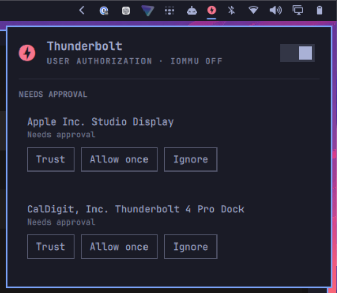
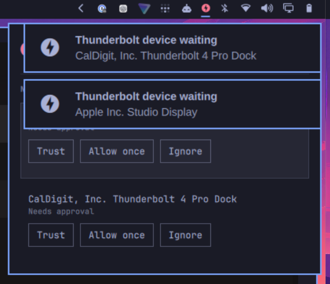
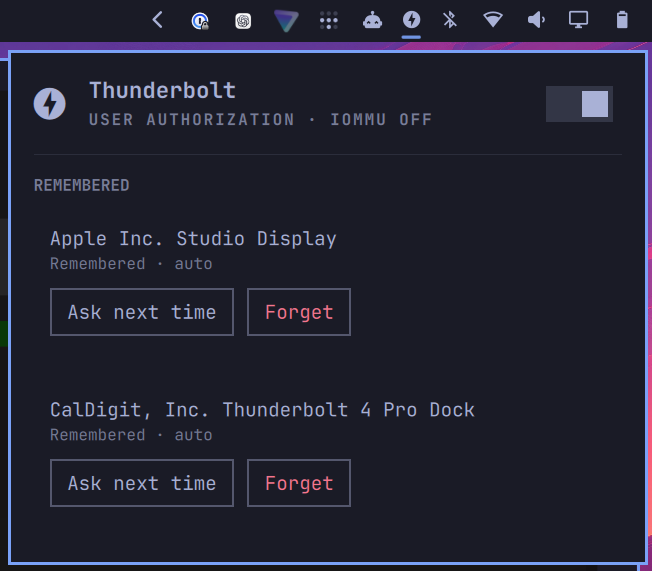
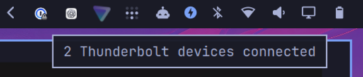

# Thunderbolt

Approve and manage Thunderbolt devices from the [Omarchy](https://omarchy.org) bar.

Omarchy already ships `bolt` and loads the `thunderbolt` kernel module early
enough for docks to work at boot. Hyprland itself never authorizes a device:
until bolt enrolls it, PCIe and DisplayPort tunnels stay down and
`hyprctl monitors` will not show a dock display. This plugin is the missing
approval UI — the Hyprland equivalent of GNOME Control Center / Plasma
Thunderbolt.

It talks to `boltd` over D-Bus. It does **not** write udev rules that
authorize every device, and it does **not** edit Hyprland monitor config.

|  |  |
|:---:|:---:|
| Needs approval | Connect notifications |
|  |  |
| Remembered devices | Bar hover |

## Install

```sh
omarchy plugin add https://github.com/unleashed-nick/omarchy-thunderbolt.git --enable
```

The widget lands on the right of the bar. Move it if you want:

```sh
omarchy bar move unleashed-nick.thunderbolt --section right
```

### Requirements

Omarchy Quattro and the `bolt` package with `bolt.service` running. Current
Omarchy already installs both. The plugin calls `omarchy notification send`
and `omarchy-shell`; nothing else is installed.

### Updating

```sh
omarchy plugin update unleashed-nick.thunderbolt
```

### Removing it

```sh
omarchy plugin remove unleashed-nick.thunderbolt
```

Enrolled devices stay in bolt's store (`boltctl list`). Forget them from the
panel before removal if you want them gone.

## Usage

| | |
| --- | --- |
| Left click | open the device panel |
| Middle click | refresh bolt's state |
| Escape | close the panel |
| Enter on a pending row | Trust |
| Delete | Ignore (pending) or Forget (remembered) |

- A new unauthorized device sends a critical notification and opens the panel.
- **Trust** enrolls the device (`auto` policy) so bolt authorizes it next time.
- **Allow once** authorizes this session only.
- **Ignore** leaves it unauthorized and stops prompting until unplug.
- **Forget** removes a stored enrollment.
- The header switch is bolt's `AuthMode` (GNOME called this Direct Access). Off
  keeps DisplayPort and USB working and blocks PCIe tunnels.

The icon hides on machines with no Thunderbolt controller and no remembered
devices. It stays visible when a controller or stored device exists. Turn on
**Always show in bar** if you want the icon everywhere.

## Security

Unknown devices are prompted, never auto-enrolled. Automatically trusting new
devices is an opt-in setting and a DMA risk on hosts without IOMMU — leave it
off unless you want GNOME Shell's behaviour.

Authorize, enroll, and forget go through bolt's polkit actions. The plugin
never calls `sudo` and never writes `/etc/udev`. On Omarchy, bolt's packaged
rule typically allows an active local `wheel` session to manage devices
without a password prompt.

## After approval

Displays appear through ordinary DRM hotplug. If a monitor is missing after
Trust, check `hyprctl monitors all` and `~/.config/hypr/monitors.lua`. This
plugin will not rewrite that file.

## License

MIT. See [LICENSE](LICENSE).
